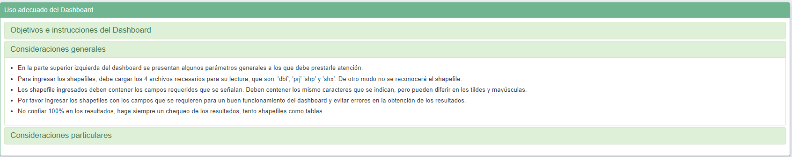
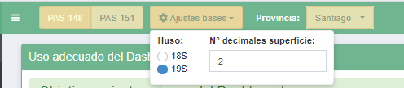
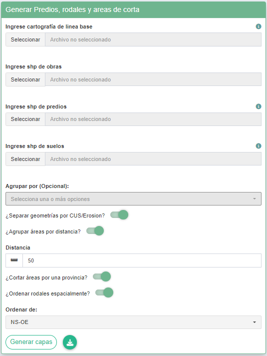
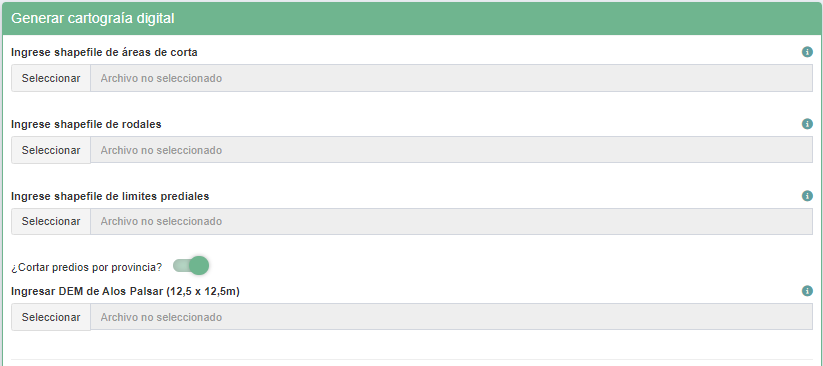
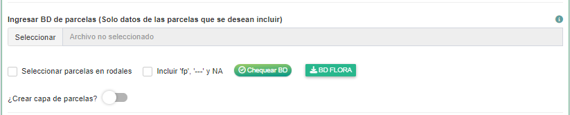
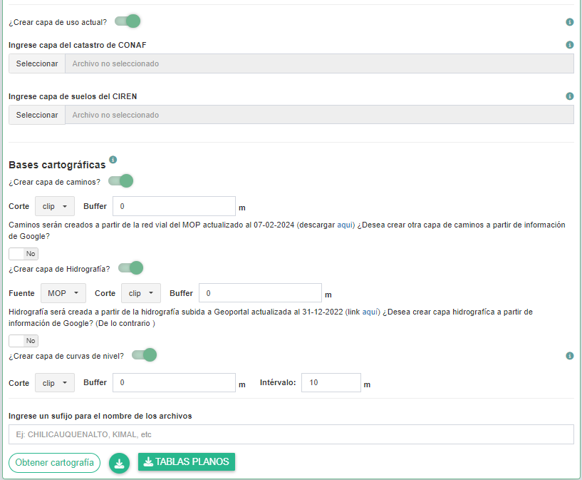
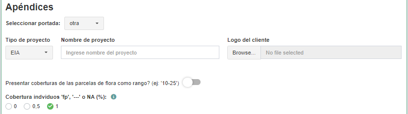
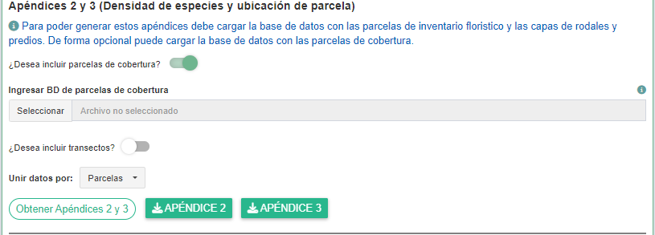
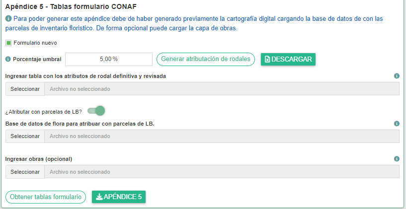
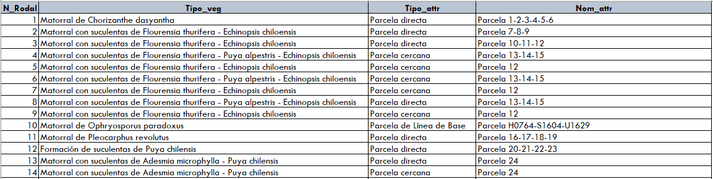

<!-- README.md is generated from README.Rmd. Please edit that file -->

```{r, include = FALSE}
  knitr::opts_chunk$set(
    collapse = TRUE,
    comment = "#>",
    fig.path = "man/figures/README-",
    out.width = "100%"
)
```
# `{PAS148y151}` <a href='https://github.com/DavidJMartinezS/PAS148y151'></a>

<!-- badges: start -->
[](http://www.gnu.org/licenses/gpl-3.0.html) 
[](https://lifecycle.r-lib.org/articles/stages.html#experimental)
<!-- badges: end -->


Este paquete está elaborado con el propósito de ayudar en la elaboración de los Permisos Ambientales Sectoriales (PAS) 148 y 151, por medio de una aplicación que facilita la elaboración de la cartografía digital y los apéndices. 
El paquete consta principalmente de la aplicación, además de algunas funciones que son utilizadas en esta misma que podrian ejecutarse en un entorno de R. 
Para un uso correcto de la aplicación, por favor tener en consideración las instrucciones que están en la primera página de la aplicación. 


## Installation

Para la instalación del paquete `{PAS148y151}` debe de ejecutar:

```{r, eval = FALSE}
options(timeout = 600)
remotes::install_github("DavidJMartinezS/dataPAS", dependencies = T, force = T)
remotes::install_github("DavidJMartinezS/PAS148y151", dependencies = T, force = T)
```

## Uso del paquete

El paquete esta hecho para que pueda ser usado tanto como en el entorno de R mediante funciones o bien en el entorno de la aplicación. Para iniciar la aplicación correr la función:

```{r, eval = FALSE}
PAS148y151::run_app()
```

Antes de todo, leer atentamente el detalle acerca del uso adecuado de la aplicación. Estas se encuentran en el acordeón que está en la pestaña 'Importante' al iniciar la aplicación.



La aplicación contiene de 3 secciones que son fundamentales para elaborar los insumos básicos. No obstante, debemos partir indicando unos parámetros básicos que son:



### Generar predios, rodales y áreas de corta preliminares

En esta sección se elaboran se elaborarán las capas de predios, rodales y áreas de corta, las cuales deberán revisarse antes de pasar a la siguiente sección. Para esto debemos ingresar las capas de linea base, layout de obras, predios y suelos. Los campos mínimos requeridos en cada una de estas capas se mencionan en el icono de información al costado derecho de cada input, como se muestra a continuación.

Tener en consideración que para cargar corresctamente un shapefile en la aplicación **debe ingresar los 4 archivos necesarios, cuyas extensiones son: '.dbf', '.prj', '.shp' y '.shx'**.



Una vez ingresadas las capas, establecer los siguientes ajustes según requiera:

* **Agrupar rodales por**: campos de la segmentación de linea base por el que se agruparían rodales. Por ejemplo, si existen 2 rodales del mismo tipo vegetacional que comparten limite, pero se dividen porque tienen diferente cobertura o exposicion, si se ingresa el campo "Tipo_veg" entonces ambos rodales se unirían siendo uno solo.
* **Cortar por CUS/Erosión**: Corta las áreas las áreas de corta por CUS o Erosión. Cada área de corta tendrá una sola CUS o Erosión.
* **Agrupar por distancias**: Agrupa todas las áreas de corta que estén a menos de la distancia que se establezca, siempre y cuando estas compartan el mismo predio, rodal y suelo. 
* **Cortar por una provincia**: Generar las capas para la provincia seleccionada en el encabezado de la aplicación. De no seleccionarse se generará las capas para todo el proyecto, aunque abarque varias provincias.
* **Ordenar rodales espacialmente**: Ordena los rodales espacialmente, de lo contrario sigue el orden de la numeración del campo 'PID', si este no se indica es creado siguiendo el orden de las entidades de la LB. Las opciones de orden consisten en una combinacion de 4 letras con las iniciales de los 4 puntos cardinales (N, S, E, O) separando con un guión latitud de longitud. 

Para realizar esto en el entorno de R usar la función `get_pred_rod_area()`. Acá un ejemplo:

```{r, eval = FALSE}
library(PAS148y151)
library(sf)

# Crear capas preliminares
capas_preliminares <- get_pred_rod_area(
  PAS = 148,                              # 148, 149 o 151
  LB = read_sf("RUTA SHP LINEA DE BASE"), # capa segmentación de linea base
  obras = read_sf("RUTA SHP OBRAS"),      # capa de obras
  predios = read_sf("RUTA SHP PREDIOS"),  # capa de predios
  suelos = read_sf("RUTA SHP SUELOS"),    # capa de suelos
  group_by_LB = NULL,                     # campos por el que se agruparían rodales. default NULL
  sep_by_soil = TRUE,                     # separar áreas de corta por campo de suelo. default TRUE
  group_by_dist = TRUE,                   # agrupar áreas de corta por distancia. default FALSE
  distance_max = 50,                      # distancia máxima para agrupar. default NULL 
  cut_by_prov = FALSE,                    # cortar por provincia. default FALSE 
  provincia = NULL,                       # provincia. si 'cut_by_prov' es TRUE. default NULL
  n_rodal_ord = TRUE,                     # ordenar rodales espacialmente. default F
  orden_rodal = "NS-OE",                  # order. default "NS-OE"
  dec_sup = 2                             # decimales para superficie. default 2
)

# Guardar capas
dir_save <- ""    # Directorio donde se guardarán las capas. Usar getwd() para usar su directorio actual.
write_sf(capas_preliminares$Predios, file.path(dir.save, "Predios_preliminares.shp"))
write_sf(capas_preliminares$Rodales, file.path(dir.save, "Rodales_preliminares.shp"))
write_sf(capas_preliminares$Areas, file.path(dir.save, "Areas_preliminares.shp"))
```

Si bien el paquete esta realizado con el objetivo de generar insumos para los PAS 148 y 151. La función `get_pred_rod_area()` junto con las funciones para generar la cartografía que se mencionan más adelante, pueden servir para realizar insumos cartográficos del PAS 149, opción que no da la aplicación.

### Generar cartografía digital 
#### Revisar capas preliminares

Una vez elaboradas las capas preliminares. Es importante que el usuario revise bien las capas generadas. Porque luego esas mismas serán las capas que se usarán para generar la cartografía digital. Tener en consideración las siguientes cosas.

* **Predios**:
  + Revisar que la numeración del campo 'N_Predio' sea la deseada.
* **Rodales**:
  + Revisar que la numeración del campo 'N_rodal' sea la deseada.
  + Revisar que la división de los rodales por los predios no generen poligonos demasiado pequeños. En ese caso se recomienda unirlos a otro del mismo rodal con mayor superficie.
* **Áreas de corta**:
  + Revisar que no se hallan generado áreas de corta con superficie de 0 ha y hacer los merge que correspondan.
  + De haberse quitado o unido áreas, reenumerarlas en el campo 'N_Area'. De lo contrario, revisar que la numeración del campo 'N_Area' sea la deseada.
  
#### inputs cartografía digital  

Revisadas las capas preliminares, podemos proseguir a generar la cartografía digital. Para efectos de la explicación, dividiremos los inputs en 3 secciones:

##### Inputs obligatorios

Los inputs obligatorios correspoden a las capas preliminares, y un DEM (modelo de elevación digital) de extensión '.tif' o '.tiff'. Además se da la opción para que el predio se limite solo a la provincia seleccionada en el encabezado del dashboard o incluir el predio completo si es que parte de este pasa hacia otra provincia. 



Al ingresar las capas preliminares en la aplicación, esta realizará un automática un chequeo de la enumeración de las áreas, rodales y predios. No obstante si esta trabajando en el entorno de R, se recomienda utilizar las siguientes funciones:
```{r, eval = FALSE}
check_n_area(areas)
check_n_rodal(rodales)
check_n_predio(predios)
```

##### Base de datos de flora

Si bien es opcional crear la capa de parcelas a partir de la base de datos de flora, definir bien cuales serán los datos que se utilizarán es imprescindible para generar más adelante los apéndices, por lo que se recomienda prestar mucha atención a esta parte.

Si desea incluir lacapa de parcelas, se requiere haber cargado previamente la base de datos de flora (.xlsx) y la capa de rodales. La base de datos de flota definitiva para la creación de las parcelas, se creará considerando los dos parámetros se se indican debajo como se muestra en la imagen, que son:

* **Seleccionar parcelas en rodales**: Selecciona solo las parcelas dentro de los rodales. De lo contrario se asumirá que la base de datos ingresada es la definitiva.
* **Incluir 'fp', '---' y NA**: Permite incluir especies que cuya cobertura de Braun Blanquet sea 'fp' o bien no se encuentra en ninguna de las categorias, como '---' o sin valores (NA). De lo contrario estos datos no serán incluidos.

Definido esto, está la opción de chequear la base de datos la cual sirve para detectar algunos errores que podria tener o situaciones que podrian generar un error posteriormente, además de un botón para descargar la base de datos que se utilizará.

Es imporante que esta se encuentre bien definida, dado que serán esos mismos datos lo que se utilizarán despues para generar los apéndices 2, 3 y 5.

Si desea cambiar el orden de las parcelas que arroja automaticamente la aplicación, descargar el excel, editar el campo 'N_Parc' y volver a ingresar.



Si está trabajando en un entorno de R, estas funciones servirán para preparar y chequear la base de datos de flora:

```{r eval = FALSE}
# Preparar base de datos de flora
bd_flora <- prepare_bd_flora(
  BD = "RUTA BD flora (.xlsx)",                 # tamibén puede ser un data.frame. ej: openxlsx2::read_xlsx("Ruta")
  rodales = read_sf("RUTA SHP RODALES (.shp)"), # capa de rodales
  PAS = 148,                                    # 148, 149 o 151
  cut_by_rod = TRUE,                            # Seleccionar parcelas en rodales.
  include_fp = FALSE                            # Incluir 'fp', '---' y NA
)

# Chequear BD flora
check_bd_flora(x = bd_flora)

# Descargar BD_flora
openxlsx2::write_xlsx(bd_flora, )
```

##### Bases cartograficas y uso actual

En esta sección se da opción de añadir la capa de uso actual, requerida en el PAS 148, además de bases cartográficas como caminos, hidrografía y curvas de nivel. existen distintos parámetros para crear las bases cartográficas, los cuales se describen visualmente presionando el icono de información junto al título de 'Bases cartográficas'.

Cabe señalar que dependiendo la cantidad y tamaño de los predios, la cantidad bases cartograficas que desea crear y los parámetros ingresados para cada una, la elaboración de la cartografía digital podría tardar más de lo normal. 

Por último, esta la opción de ingresar el sufijo que llevará cada una de las capas. 





Una vez generada la cartografía digital, podrá descargarla como zip, donde irán también dos Excel con detalles de las áreas de corta y predios. También podrá descargar las tablas de predios y áreas que van en los planos.

Si esta trabajando en un entorno de R, considerar:
```{r eval = FALSE}
# Las siguientes funciones para generar capas en particular
cart_rodales()     
cart_suelos()
cart_rang_pend()
cart_predios()
cart_parcelas()
cart_uso_actual()
cart_hidro()
cart_hidro_osm()
cart_caminos()
cart_caminos_osm()
cart_curv_niv()

# Función para generar cartografía digital
get_carto_digital(
  PAS,                                           # 148, 149 o 151
  areas,                                         # capa de áreas
  rodales,                                       # capa de rodales
  predios,                                       # capa de predios
  cut_by_prov = NULL,                            # NULL o provincia
  dem,                                           # DEM. SpatRaster o ruta del raster
  add_parcelas = FALSE,                          # agregar parcelas
  bd_flora = NULL,                               # base de datos de flora
  cut_by_rod,                                    # Seleccionar parcelas en rodales
  include_fp = FALSE,                            # Incluir 'fp', '---' y NA
  from_RCA = FALSE,                              # fuente de RCA?
  RCA = NULL,                                    # RCA
  add_uso_actual = FALSE,                        # agregar capa de uso actual
  catastro = NULL,                               # capa de catastro CONAF
  suelos = NULL,                                 # capa de suelos CIREN
  add_caminos = FALSE,                           # agregar caminos
  add_caminos_osm = FALSE,                       # agregar caminos OpenStreetMap
  caminos_arg = list(cut = "clip", buffer = 0),  # argumentos caminos
  add_hidro = FALSE,                             # agregar hidrografía
  fuente_hidro = c("MOP", "BCN"),                # fuente de hidrografía. MOP o BCN
  add_hidro_osm = FALSE,                         # agregar hidrografía OpenStreetMap
  hidro_arg = list(cut = "clip", buffer = 0),    # argumentos hidrografía
  add_curv_niv = FALSE,                          # agregar curvas de nivel
  curv_niv_arg = list(cut = "clip", buffer = 0), # argumentos curvas de nivel
  step = 10,                                     # intervalo curvas de nivel
  dec_sup = 2                                    # decimales para superficie en hectárea
)

# ver documentación con mayor detalle
?get_carto_digital()
```

### Generar apéndices
Estos apéndices corresponden a:
* **Apéndice 2**: Densiadad de especies
* **Apéndice 3**: Coordenadas ubicación de parcelas
* **Apéndice 5**: Tablas formulario CONAF

Ajustes generales:
* Portada: Elejir una plantilla de portada o bien crear una añadiendo los datos de tipo y nombre de proyecto más el logo del cliente.
* Si esta haciendo un PAS 151, elejir si presentar coberturas como rango (ej: 10-25) o número (ej: 17,5), y la cobertura que le asignará a los individuos cuya cobertura de Braun Blanquet sea 'fp', '---' o NA, de haberlos incluido.



#### Apéndice 2 y 3

Para poder generar estos apéndices debe cargar la base de datos con las parcelas de inventario floristico y las capas de rodales y predios. De forma opcional puede cargar la base de datos con las parcelas de cobertura y/o transectos para el caso de los PAS 151. De incluir otros datos, establecer si unión entre estos será mediante el nombre de parcelas o por sus coordenadas.



Si estas en el entorno de R, utilizar:
```{r eval = FALSE}
library(openxlsx2)

# Preparar y chequear bases de datos de parcelas de cobertura y transectos.
bd_pcob <- prepare_bd_pcob(BD)   # Ruta (.xlsx) con los datos. O un data.frame. ej: openxlsx2::read_xlsx("Ruta")
check_bd_pcob(bd_pcob)
bd_pcob <- prepare_bd_trans(BD)  # Ruta (.xlsx) con los datos. O un data.frame. ej: openxlsx2::read_xlsx("Ruta") 
check_bd_pcob(bd_pcob)

# Generar apéndices 2 y 3  
ap_2_3 <- apendice_2_3(
  PAS,                     # 148 o 151
  bd_flora,                # base de datos de flora
  bd_pcob = NULL,          # base de datos de parcelas de cobertura. Opcional
  bd_trans = NULL,         # base de datos de transectos. Opcional
  join_by = "coordenadas", # union por 'parcela' o 'coordenadas'. Default 'coordenadas'
  predios,                 # capa de predios
  cov_as_range = FALSE,    # cobertura como rangos
  cov_fp = 1,              # cobertura para individuos 'fp', '---' o NA
  provincia,               # Nombre de la provincia
  portada = "default",     # Plantilla portada
  portada_opts = NULL      # Opciones para personalizar una portada
)

# Descargar apéndices 2 y 3
wb_save(ap_2_3$Apendice_2, file.path(dir_save, "Apéndice 2 - Densiadad de especies.xlsx"))
wb_save(ap_2_3$Apendice_3, file.path(dir_save, "Apéndice 3 - Coordenadas ubicación de parcelas.xlsx"))
```

#### Apéndice 5

Para poder generar este apéndice debe de haber generado previamente la cartografía digital, cargando la base de datos con las parcelas de inventario floristico.

La parte central de este apéndices corresponde a la tributación de rodales utilizando los datos de las parcelas. Para esto se deben seguir los siguientes pasos: 



* Generar y descargar la tabla de atributación de rodales. En esta se indica por rodal si se atributará con parcela directa o estimación por tipo vegetacional.
* Revisar las parcelas de estimación y ver si pueden atributarse con alguna parcela cercana del mismo tipo vegetacional. En ese caso colocar en la columna Tipo_attr 'Parcela cercana' e indicar la el N° de parcela en la columna Nom_attr.
* Revisar de forma particular aquellas que tienen en la columna Nom_attr 'Estimación por Tipo vegetacional similar', dado que son rodales con un tipo vegetacional que no tiene muestreo en la provincia. En estos caso se recomienda buscar una parcela de linea base que pueda atributar ese tipo vegetacional pero y colocar en la columna Tipo_attr 'Parcela línea de base' e indicar el nombre de la parcela en la columna Nom_attr como se muestra a continuación.



Una vez lista la tabla, manteniendo el formato de ejemplo, cargarla en la aplicación. Si se utilizaron parcelas de línea base ajenas a las parcelas de la cartografía digital, cargar base de datos donde se encuentren dichas parcelas. Con esto ya puedes generar las tablas del formulario.

Si estas en el entorno de R, utilizar:
```{r eval = FALSE}
# Generar tabla de atributo de rodal  
tabla_attr_rodal <- get_tabla_attr_roda(
  PAS,                    # 148 o 151
  bd_flora,               # base de datos de flora
  rodales,                # capa de rodales
  umbral_sp_est = 0.05    # porcentaja umbral
)

# Descargar tabla atributos de rodal
wb_save(tabla_attr_rodal, file.path(dir_save, "tabla_attr_rodal.xlsx"))

# Generar apéndice 5 PAS 148
ap_5 <- apendice_5_PAS148(
  bd_flora,               # base de datos de flora
  rodales,                # capa de rodales
  tabla_predios,          # tabla de predios. Generada en la cartografía digital
  tabla_areas,            # tabla de áreas. Generada en la cartografía digital
  tabla_attr_rodal,       # Tabla de atributos de rodal revisada
  umbral_sp_est = 0.05,   # porcentaja umbral
  bd_flora_2 = NULL,      # base de datos de flora para atributación de rodales con parcelas de LB
  provincia,              # Nombre de la provincia
  portada = "default",    # Plantilla portada
  portada_opts = NULL,    # Opciones para personalizar una portada
  carto_uso_actual = NULL # Capa de uso actual. Opcional. Generada en la cartografía digital
)

# Generar apéndice 5 PAS 151 formulario antiguo
ap_5 <- apendice_5_PAS151(
  bd_flora,               # base de datos de flora
  rodales,                # capa de rodales
  tabla_predios,          # tabla de predios. Generada en la cartografía digital
  tabla_areas,            # tabla de áreas. Generada en la cartografía digital
  tabla_attr_rodal,       # Tabla de atributos de rodal revisada
  cov_as_range = FALSE,   # cobertura como rangos
  cov_fp = 1,             # cobertura para individuos 'fp', '---' o NA
  umbral_sp_est = 0.05,   # porcentaja umbral
  bd_flora_2 = NULL,      # base de datos de flora para atributación de rodales con parcelas de LB
  portada = "default",    # Plantilla portada
  portada_opts = NULL,    # Opciones para personalizar una portada
  provincia,              # Nombre de la provincia
  areas = NULL,           # capa de áreas de corta. Opcional
  obras = NULL            # Capa de layout de obras. Opcional
)

# Generar apéndice 5 PAS 151 formulario nuevo
ap_5 <- apendice_5_PAS151_nuevo(
  bd_flora,               # base de datos de flora
  rodales,                # capa de rodales
  tabla_predios,          # tabla de predios. Generada en la cartografía digital
  tabla_areas,            # tabla de áreas. Generada en la cartografía digital
  tabla_attr_rodal,       # Tabla de atributos de rodal revisada
  cov_as_range = FALSE,   # cobertura como rangos
  cov_fp = 1,             # cobertura para individuos 'fp', '---' o NA
  umbral_sp_est = 0.05,   # porcentaja umbral
  bd_flora_2 = NULL,      # base de datos de flora para atributación de rodales con parcelas de LB
  portada = "default",    # Plantilla portada
  portada_opts = NULL,    # Opciones para personalizar una portada
  provincia,              # Nombre de la provincia
  areas = NULL,           # capa de áreas de corta. Opcional
  obras = NULL            # Capa de layout de obras. Opcional
)

# Descargar apéndice 5
wb_save(ap_5, file.path(dir_save, "Apéndice 5 - Tablas formulario CONAF.xlsx"))
```

**Se solicita reportar cualquier error o bug de la aplicación y/o sus funciones**


